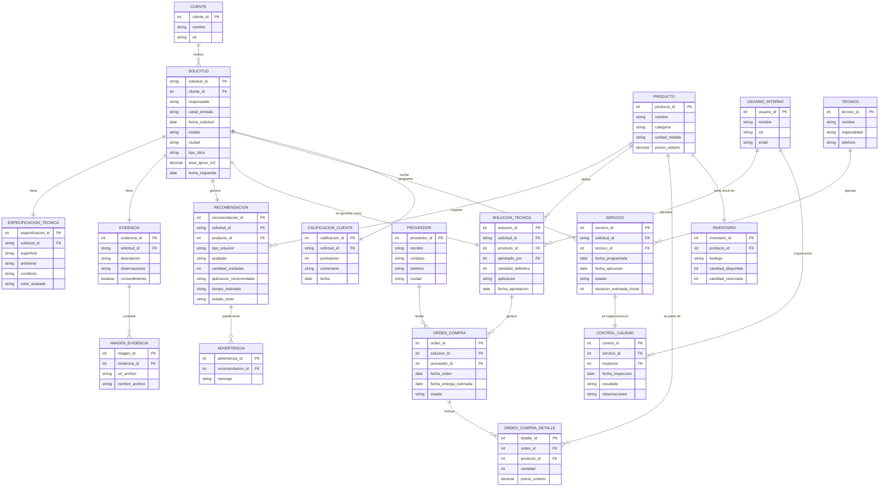

# Modelo relacional completo — Colorlink

Modela las **5 etapas del negocio** (`Necesidad → Solución técnica → Abastecimiento → Servicio → Calidad`),
aunque el frontend de cliente solo implementa la primera (ver `ARQUITECTURA.md`). El objetivo es
documentar el sistema completo, no solo la pantalla construida.

Diagrama fuente: `colorlink-modelo-completo.drawio` (18 tablas, ábrelo en [app.diagrams.net](https://app.diagrams.net)).

## Tablas por etapa

**Necesidad del cliente** (7): CLIENTE, SOLICITUD, ESPECIFICACION_TECNICA, EVIDENCIA, IMAGEN_EVIDENCIA, RECOMENDACION, ADVERTENCIA
**Solución técnica** (2): PRODUCTO, SOLUCION_TECNICA
**Abastecimiento** (4): PROVEEDOR, ORDEN_COMPRA, ORDEN_COMPRA_DETALLE, INVENTARIO
**Servicio** (2): TECNICO, SERVICIO
**Calidad** (2): CONTROL_CALIDAD, CALIFICACION_CLIENTE
**Transversal** (1): USUARIO_INTERNO

## Cambios de normalización sobre el modelo original (7 tablas)

`RECOMENDACION.producto` pasó de texto libre (`VARCHAR`) a `FK → PRODUCTO`, apoyándose en el nuevo
catálogo de productos — evita repetir el nombre de un mismo recubrimiento en cada solicitud.

## Relaciones nuevas (además de las 6 ya documentadas del modelo de Necesidad)

- PRODUCTO **1:N** RECOMENDACION — un producto puede aparecer en muchas recomendaciones.
- SOLICITUD **1:1** SOLUCION_TECNICA — cada solicitud, una vez aprobada, tiene una solución técnica oficial.
- PRODUCTO **1:N** SOLUCION_TECNICA
- USUARIO_INTERNO **1:N** SOLUCION_TECNICA — quién aprobó la solución (`aprobado_por`).
- SOLUCION_TECNICA **1:N** ORDEN_COMPRA — una solución puede requerir varias órdenes de compra.
- PROVEEDOR **1:N** ORDEN_COMPRA
- ORDEN_COMPRA **1:N** ORDEN_COMPRA_DETALLE — una orden trae varios productos (tabla puente).
- PRODUCTO **1:N** ORDEN_COMPRA_DETALLE
- PRODUCTO **1:1** INVENTARIO — cada producto tiene un único registro de stock.
- SOLICITUD **1:N** SERVICIO — una solicitud puede requerir más de una visita técnica.
- TECNICO **1:N** SERVICIO
- SERVICIO **1:1** CONTROL_CALIDAD — cada visita se inspecciona una vez.
- USUARIO_INTERNO **1:N** CONTROL_CALIDAD — quién inspeccionó (`inspector`).
- SOLICITUD **1:1** CALIFICACION_CLIENTE — el cliente califica una vez, al cierre del ciclo.

## Mermaid ER (modelo completo)

## Revisión

- 18 tablas, 20 relaciones, todas con cardinalidad justificada por el flujo real del negocio.
- Ninguna FK sin su PK correspondiente.
- Normalizado: sin campos multivaluados (fotos, advertencias, detalle de orden de compra son
  todas tablas propias en vez de columnas con listas).
- El frontend actual solo persiste las 7 tablas de "Necesidad del cliente" (ver `src/domain/solicitud/types.ts`);
  las 11 restantes documentan el resto del ecosistema para efectos de diseño y evaluación.
